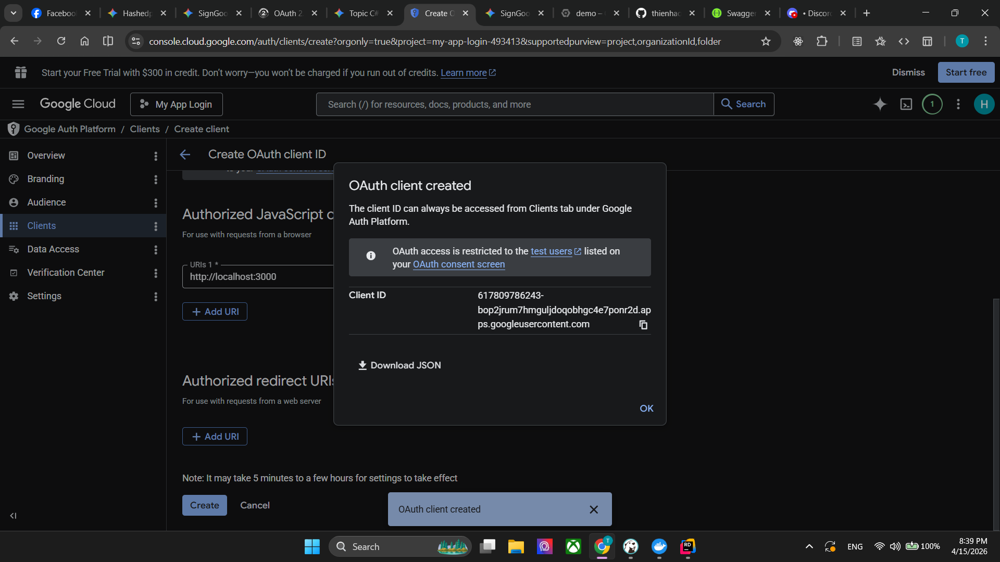

# Hướng dẫn lấy Client ID và Client Secret từ Google Cloud

### Bước 1: Tạo dự án trên Google Cloud
1. Truy cập vào [Google Cloud Console](https://console.cloud.google.com/) và đăng nhập bằng tài khoản Google của bạn.
2. Nhìn lên thanh menu trên cùng, click vào dropdown chọn dự án (ngay cạnh logo Google Cloud) và chọn **New Project** (Dự án mới).
3. Đặt tên cho dự án (ví dụ: `My App Login`) và nhấn **Create** (Tạo). Đợi vài giây để Google tạo dự án, sau đó nhớ chọn dự án bạn vừa tạo để bắt đầu làm việc.

---

### Bước 2: Cấu hình "Màn hình đồng ý" (OAuth consent screen)
Trước khi lấy được Key, Google bắt bạn phải khai báo xem ứng dụng của bạn tên gì để họ hiện lên cho người dùng lúc đăng nhập.

1. Ở menu bên trái, tìm đến mục **[APIs & Services (API và Dịch vụ)](https://console.cloud.google.com/apis/dashboard)** > Chọn **OAuth consent screen** (Màn hình đồng ý OAuth).
2. Tại phần *User Type*, chọn **External** (Bên ngoài - dành cho bất kỳ ai có tài khoản Google) rồi nhấn **Create**.
3. Điền các thông tin bắt buộc:
    * **App name:** Tên ứng dụng của bạn (sẽ hiện lúc người dùng đăng nhập).
    * **User support email:** Email của bạn.
    * Kéo xuống dưới cùng phần **Developer contact information**, điền email của bạn lần nữa.
4. Nhấn **Save and Continue** liên tục qua các bước *Scopes*, *Test users* (bạn có thể bỏ qua các phần này) cho đến khi về lại trang Dashboard.

---

### Bước 3: Tạo Client ID và Client Secret
Bây giờ là bước lấy cái bạn cần:

1. Cũng ở menu bên trái mục *APIs & Services*, chọn **[Credentials (Thông tin xác thực)](https://console.cloud.google.com/apis/credentials)**.
2. Nhìn lên trên cùng, bấm vào dấu **+ CREATE CREDENTIALS** (Tạo thông tin xác thực) > Chọn **OAuth client ID**.
3. Tại ô *Application type*, chọn **Web application** (Ứng dụng web).
4. Đặt tên ở ô *Name* (ví dụ: `Web Client 1`).

---

### Bước 4: Cấu hình URL cho Frontend (Rất quan trọng)
Kéo xuống một chút, bạn sẽ thấy phần **Authorized JavaScript origins** (Nguồn gốc JavaScript được phép). Đây là danh sách các domain được phép gọi đến Google để xin Token.

1. Bấm **ADD URI**.
2. Điền domain của Frontend vào. Ví dụ bạn đang chạy React dưới máy tính thì điền: `http://localhost:3000` (hoặc port tương ứng của bạn). *Lưu ý: Không có dấu gạch chéo `/` ở cuối.*
> **Lưu ý phụ:** Phần *Authorized redirect URIs* bên dưới bạn có thể để trống nếu dùng luồng Frontend lấy Token.

---

### Bước 5: Lấy Key về appsettings.json
1. Bấm **CREATE** (Tạo).
2. Một bảng Popup sẽ hiện ra màn hình thông báo **"OAuth client created"**.
3. Tại đây, bạn sẽ thấy rõ 2 chuỗi:
    * **Your Client ID** (Sao chép bỏ vào `ClientId` trong C#).
    * **Your Client Secret** (Sao chép bỏ vào `ClientSecret`).
   


**Bỏ Client Secret**

```csharp
"GoogleAuthOptions": {
    "ClientId": "617809786243-bop2jrum7hmguljdoqobhgc4e7ponr2d.apps.googleusercontent.com"
  }
```