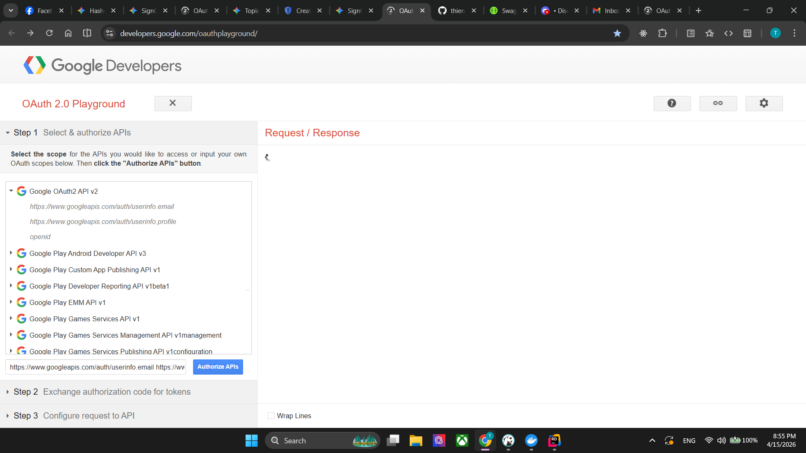
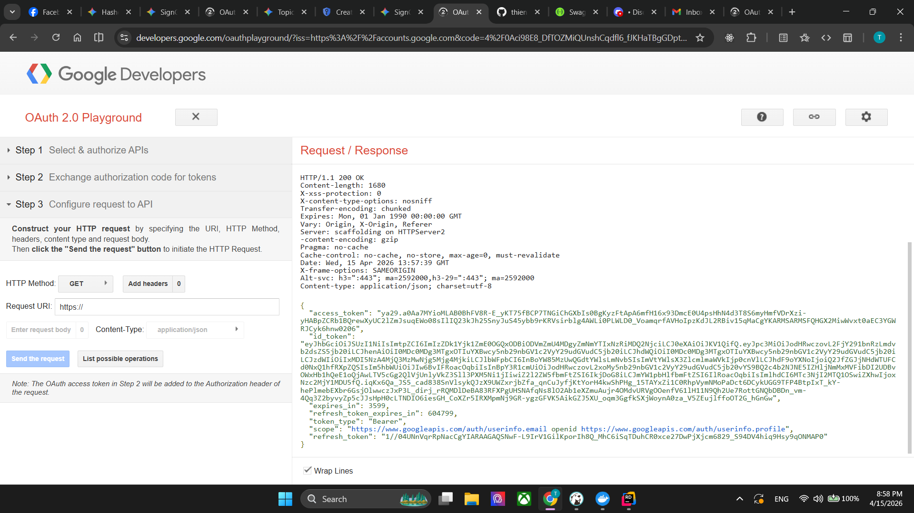
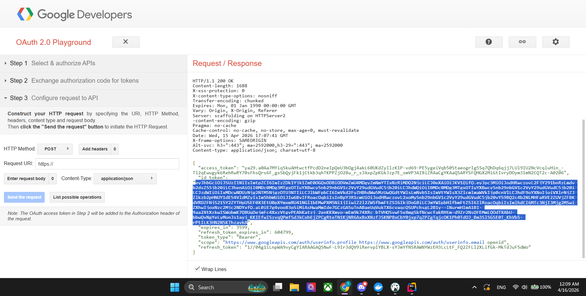
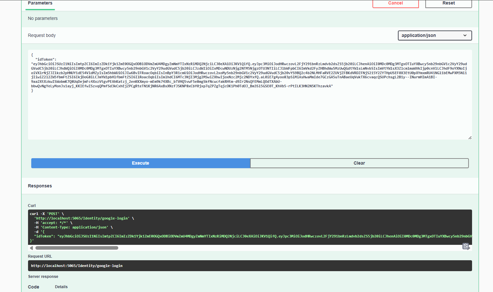
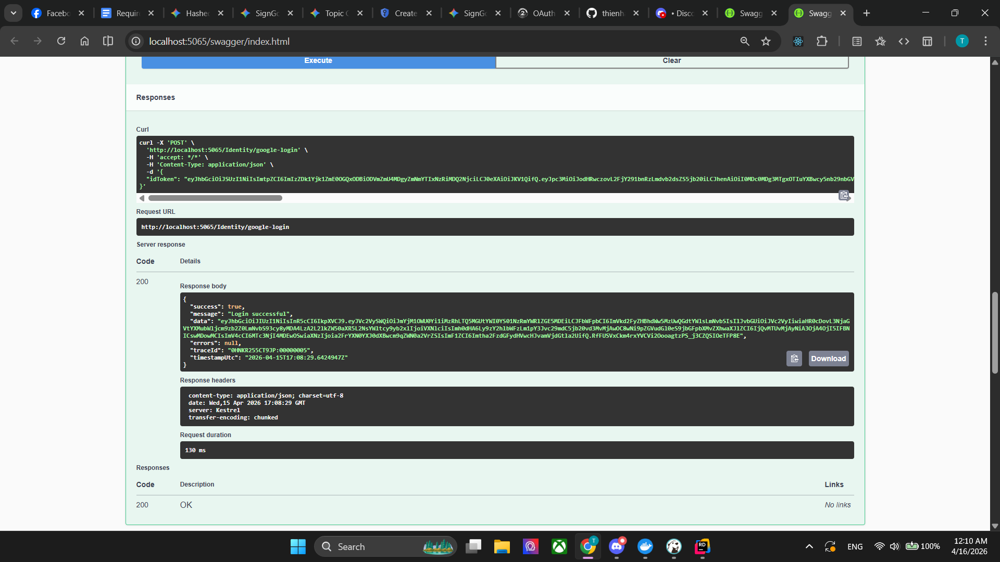
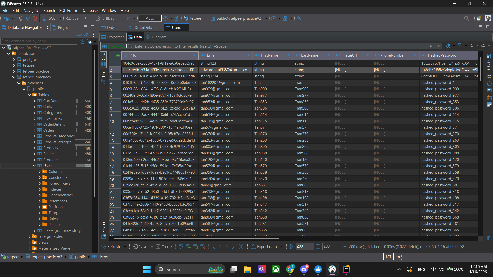

# Hướng dẫn Test API Google Login bằng Swagger/Postman

Cách này giúp bạn kiểm tra Backend C# xem đã hoạt động chuẩn chưa mà **không cần phải viết code Frontend**. Chúng ta sẽ "xin" tạm một Token thật từ Google để test.

### Bước 1: Lấy Token thật từ Google OAuth Playground
1. Truy cập vào công cụ chính chủ của Google: **[Google OAuth 2.0 Playground](https://developers.google.com/oauthplayground/)**.
2. Nhìn sang cột bên trái phần **Step 1**, cuộn xuống tìm và click mở rộng mục **Google OAuth2 API v2**.
3. Tích chọn vào 2 dòng sau:
    * `https://www.googleapis.com/auth/userinfo.email`
    * `https://www.googleapis.com/auth/userinfo.profile`
4. Bấm nút màu xanh **Authorize APIs**. Một cửa sổ sẽ hiện ra yêu cầu bạn đăng nhập bằng tài khoản Google. Cứ đăng nhập và chọn *Tiếp tục/Allow* để cấp quyền bình thường.
5. Sau khi đăng nhập xong, giao diện sẽ tự động chuyển sang **Step 2**. Tại đây, bạn bấm vào nút màu xanh **Exchange authorization code for tokens**.
6. Web tiếp tục tự chuyển sang **Step 3**. Tại đây, bạn nhìn vào ô chữ nhật chứa code bên phải màn hình, kéo xuống dưới tìm dòng chữ có chứa **`"id_token": "eyJhbGci..."`**.
7. **Copy toàn bộ chuỗi ký tự cực dài đó** (lưu ý: chỉ copy phần chữ, bỏ qua dấu ngoặc kép `"` ở hai đầu). Đây chính là mã Token thật!

---

### Bước 2: Bắn Token vào API C# của bạn
1. Mở Project C# của bạn lên (chạy Swagger hoặc mở Postman).
2. Tìm đến API `POST /google-login` mà chúng ta đã viết.
3. Trong phần Request Body, điền dữ liệu theo định dạng JSON như sau:
   ```json
   {
     "idToken": "Dán_chuỗi_id_token_bạn_vừa_copy_ở_bước_1_vào_đây"
   }
   



Email cần phải được tạo trong DB, đã hash password đầy đủ


