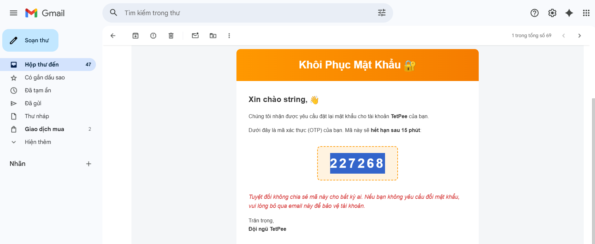

### Khác biệt về quy trình (UX/Security)

| Đặc điểm | Forgot Password | Reset Password |
| :--- | :--- | :--- |
| **Trạng thái đăng nhập** | Người dùng đang **đứng ngoài** hệ thống và không thể đăng nhập. | Có thể thực hiện khi đang đứng ngoài hoặc đã đăng nhập (thay đổi mật khẩu). |
| **Yêu cầu xác minh** | Cần xác minh danh tính qua bên thứ ba như Email, SMS, mã OTP hoặc câu hỏi bảo mật. | Yêu cầu nhập mật khẩu mới (và đôi khi là mật khẩu cũ nếu đang đăng nhập) để hoàn tất. |
| **Tính chủ động** | Người dùng yêu cầu sự giúp đỡ từ hệ thống do mất thông tin. | Là một lệnh thực thi trực tiếp để cập nhật lại cơ sở dữ liệu mật khẩu. |

